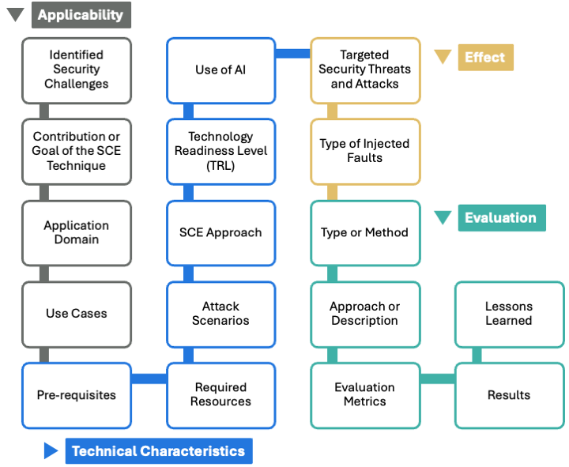

# SCENE Guidelines for Security Chaos Engineering
SCENE is a comprehensive set of guidelines for systematically reporting Security Chaos Engineering (SCE).
SCENE aims to help  SCE creators and developers in enabling informed decision-making, ensuring clarity, facilitating replication, and supporting the development of robust SCE strategies and practices tailored to specific systems and threat landscapes.

Figure 1 shows the aspects or characteristics useful for reporting SCE techniques and practices, which form the basis for SCENE guidelines. These characteristics are as follows:

<figure>
  
  <figcaption><strong>Figure 1:</strong> SCENE guidelines for Reporting SCE techniques and practices.</figcaption>
</figure>

 
 
 

**1. Applicability**: It is important to report the “Applicability” of the developed SCE technique. The applicability characteristic provides a comprehensive understanding of the technique’s relevance, ensuring that stakeholders can assess the technique’s value and suitability for their specific needs. By detailing the identified security challenges, the creators can highlight and motivate the specific issues the technique addresses. The contribution or goal outlines the intended outcomes, ensuring clarity on what the technique aims to achieve. The application domain helps in identifying the contexts in which the technique is most beneficial, guiding potential users on where and how to apply it effectively. Finally, the use cases demonstrate practical applications, showcasing how the technique can be implemented in real-world scenarios.

**2. Technical Characteristics**: Reporting the “Technical Characteristics” of a SCE technique is crucial as it provides a comprehensive understanding of the technique’s operational peculiarities. This category outlines the prerequisites, required resources, attack scenarios, SCE approach, (TRL), and the use of AI, which collectively ensure that stakeholders can accurately assess the feasibility, implementation requirements, and used technologies.

**3. Effect**: Considering the “Effect”, it provides a comprehensive understanding of the specific security threats and attacks targeted, such as those categorized by STRIDE. Additionally, detailing the types of injected faults, like manipulation of configurations or disabling of functionalities, helps in assessing the impact and effectiveness of the technique. This information is essential for stakeholders to evaluate the robustness of their security measures and identify potential vulnerabilities.

**4. Evaluation**: The “Evaluation” of the SCE technique should be comprehensively reported since it promotes transparency and credibility. By detailing the type or method of evaluation, whether analytical, empirical, or both, creators can communicate the practicality of the conducted evaluation. Moreover, describing how the evaluation was conducted, sharing the replication package, and reporting the used quantitative and qualitative metrics (e.g., time to complete an attack or security performance) promote replication and help stakeholders understand the effectiveness and efficiency of the SCE technique. Finally, summarizing the results and lessons learned highlights
practical implications, pros, cons, and potential side effects. This enables SCE practitioners making informed decisions about adopting or improving the SCE technique.

Table 1 provides a summary of the main characteristics as well as sub-characteristics and reports a description or example of each characteristic. 

 

**Table 1: SCENE for Categorization of Techniques for Supporting Resilience Using Security Chaos Engineering.**
| **Characteristic**              | **Sub-Characteristic**                   | **Description or Example**                                                                 |
|--------------------------|------------------------------------|---------------------------------------------------------------------------------------------|
| Applicability            | Identified Security Challenges     | The motivation for using SCE for cybersecurity, e.g., limitations of other approaches and increasing confidence in system resilience. |
|                          | Contribution/Goal                  | The main objective of the study and the main contribution, e.g., a SCE framework for early threat detection. |
|                          | Application Domain                 | E.g., general purpose, IoT, cloud.                                                          |
|                          | Use Cases                          | E.g., improve resilience, identification of vulnerabilities.                                |
| Technical Characteristics| Prerequisites                      | E.g., system design, specific data.                                                         |
|                          | Required Resources                 | Required hardware and software resources, e.g., sensors, virtual machines.                 |
|                          | Attack Scenarios                   | Methodology used to derive attack scenarios, e.g., attack trees, attack goals.             |
|                          | SCE Approach                       | A description of the SCE approach including main steps and processes.                      |
|                          | TRL                                | The Technical Readiness Level1 of the proposed approach.                                    |
|                          | Use of AI                          | Whether the approach utilizes artificial intelligence.                                     |
| Effect                   | Targeted Security Threats or Attacks | What STRIDE threats are targeted.                                                         |
|                          | Type of Injected Faults            | E.g., misconfiguration, data/resource injections.                                          |
| Evaluation               | Method                             | Analytical2, Empirical3, Both.                                                               |
|                          | Description                        | Description of how the evaluation was conducted.                                           |
|                          | Metrics                            | Quantitative and qualitative criteria and metrics used in the evaluation e.g., time to complete attack, security performance. |
|                          | Results of the Evaluation          | The results of the evaluation in terms of the evaluation criteria.                         |
|                          | Lessons Learned                    | Pros, cons, side effects.                                                                  |

1 *[TRL](https://en.wikipedia.org/wiki/Technology_readiness_level)*: J. C. Mankins et al., “Technology readiness levels,” White Paper, April, vol. 6, no. 1995, 1995. 
 
2 *Analytical Evaluation*: An analytical evaluation focuses on theoretical analysis or formal methods
 
3 *Empirical Evaluation*: An empirical evaluation involves experimentation or observation, often using real-world deployments, simulations, or prototypes.

## Publication and Citation

- Publication: Rodi Jolak et al. "SCENE: Guidelines for Security Chaos Engineering based on a Systematic Literature Review".
- How to cite: to appear.

## Badges

